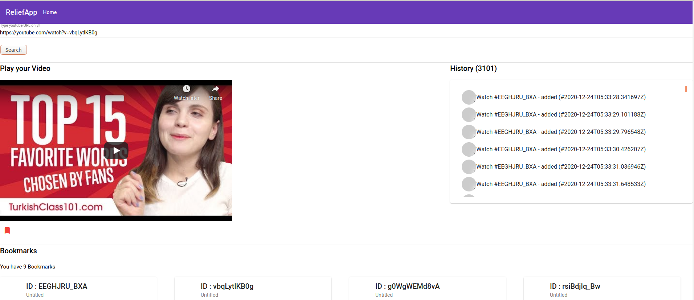
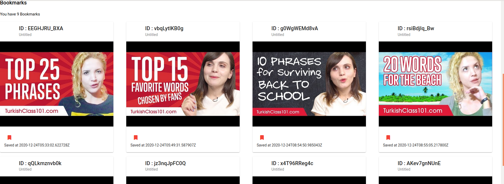

# video_player_application_frontend_part
this is a fully video player application - frontend part - using angular framework. for backend part is [here](https://github.com/kertijayancom/video_player_application_backend_part)

# **instalation**

for better experience, please install npm and a whole package from project

run the app!!
```bash
ng serve
```

## **How it works**


A simple Angular Apps to play youtube by youtubeURL and manage histories and bookmarks.


## **LIST API**

The Project Contain:
- searchBar : input youtubeUrl
- videoPlayer: display youtubeVideo and has option to bookmarks it. automatically add it as history record
- historyPanel : on left side. in scrollbar mode, it contains all history youtube playing.
- bookmarkPanel : on bottom side, by navigation page.


This Project was generated using Angular Material and Flex
This project was generated with [Angular CLI](https://github.com/angular/angular-cli) version 11.0.5.





implementation of InMemoryDbService soon!
